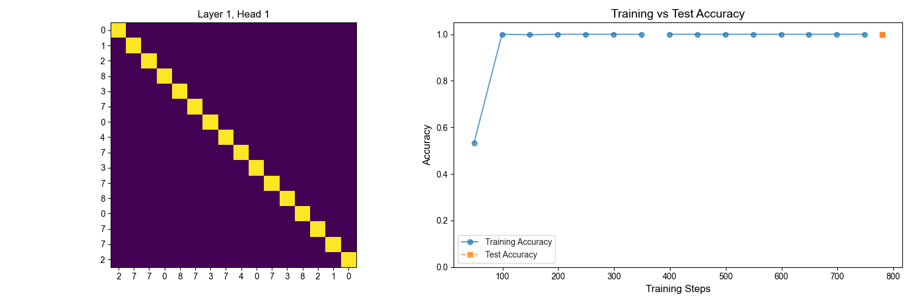

**Important Links**  
> [📌 Project Notes](./Notes.md)


# 1. Overview
```
# Transformer Architecture Experiments

This project implements a bidirectional Transformer encoder for three sequence processing tasks:
1. Numerical Sequence Transformation
   - Sequence reversal (e.g., 1234 → 4321)
   - Sequence shifting (e.g., 1234 → 2341)
   - Visualized self-attention patterns demonstrate the model's contextual learning mechanism
2. IMDB Sentiment Analysis (Binary Classification)
   - Comparative evaluation of embedding strategies:
     - Pretrained Word2Vec
     - GloVe (Global Vectors, 300-dim)
     - Trainable PyTorch embeddings
   - Learning rate scheduler comparison:
     - Original Transformer linear warmup
     - Cosine warmup
     - Constant learning rate
   - Achieved 87% validation accuracy with 4 attention heads


## Key Features
- Multi-head attention implementation with configurable heads (4-8)
- Three learning rate scheduling strategies:
  - Linear warmup (1e-7 → 1e-3 over 4k steps)
  - Cosine annealing with warm restarts
  - Constant learning rate at 5e-4
- Integrated visualization tools:
  - TensorBoard for training metrics tracking
  - Attention matrix heatmaps for model interpretation

## Experimental Insights
1. Attention patterns for numerical tasks show clear diagonal focus positions
2. Trainable embeddings outperformed static embeddings by F1-score
3. Proper learning rate (1e-4 to 1e-3) is crucial
4. 4-head attention achieved best accuracy/throughput balance (78 samples/sec)

## Sample Tests for IMDB Review Sentiment Analysis
1. Reviews
The model achieves comparable training and validation accuracy scores (~85%), 
but qualitative analysis reveals limitations in classifying simple, unseen sentences. 
Interestingly, while quantitative metrics show similar performance across embedding methods, 
PyTorch's native embeddings demonstrate superior relative sentiment scoring compared to 
pre-trained GloVe and Word2Vec embeddings in these tests. Note: here embeddings are frozen
during the training.

Notable observations:
- Randomly initialized PyTorch embeddings outperform pre-trained counterparts in sentiment intensity ranking
- Model struggles with syntactic variations despite high accuracy scores
- Embedding performance gap persists across different random initializations
- Quantitative metrics (accuracy, F1) don't fully capture semantic ranking capabilities

2. Sample setting comparison
    num_layers=4,
    model_dim=16,
    fea_dim=16,
    num_heads=4, # note: fea_dim % num_heads == 0
    mlp_dim=32,
    num_classes=train_loader.dataset.num_categories,
    dropout=0.3,
    input_dropout=0,
```


```
3. Embedding Trainable
The trainable parameters are too many given the limit training data. The performances all become similar to each other.
```


## Shakespeare Style Learning Task (Decoder)
### Left-padding is important and improve training result
### Pre-LayerNorm is better than Post-LayerNorm with different range of learning rate
### Cosine warmup learning schedule is significantly more effective than constant learning schedule
### Experiment with position encoding at embedding space or model space: not conclusive
### Experiment with num_layers, 4 or 8: not conclusive
### Experiment: Ensure tiny numbers in attention matrix according to mask to handle case where whole rows are 0.
```
  mask[0, 0, -2, :] = tensor([True, True, True, True, True, True, True, True, True, True, True, True,
        True, True, True, True, True, True, True], device='mps:0')

  attention_scores[0, 0, -2, :] = tensor([-1.0000e+18, -1.0000e+18, -1.0000e+18, -1.0000e+18, -1.0000e+18,
        -1.0000e+18, -1.0000e+18, -1.0000e+18, -1.0000e+18, -1.0000e+18,
        -1.0000e+18, -1.0000e+18, -1.0000e+18, -1.0000e+18, -1.0000e+18,
        -1.0000e+18, -1.0000e+18, -1.0000e+18, -1.0000e+18], device='mps:0')

  Before fix:
  attention_mat[0, 0, -2, :] = tensor([0.0526, 0.0526, 0.0526, 0.0526, 0.0526, 0.0526, 0.0526, 0.0526, 0.0526,
        0.0526, 0.0526, 0.0526, 0.0526, 0.0526, 0.0526, 0.0526, 0.0526, 0.0526,
        0.0526], device='mps:0')

  After fix:
  attention_mat[0, 0, -2, :] = tensor([0., 0., 0., 0., 0., 0., 0., 0., 0., 0., 0., 0., 0., 0., 0., 0., 0., 0., 0.],
       device='mps:0')
```
### Experiment with Embed Torch vs GloVe, Unfreeze: GloVe always worse than Embed
### Experiment with next word selection
#### 1 Sampe from the largest probability value
eg.

The edge of war , and the son of York , the Earl of York , , wake , , , , , , , wake , wake , wake , , , , , , , , , , wake , , , , , , , , , , , , , , , , , , ! , ! It beside beside beside , , , , , , ! ! , , , , , , , , , , , , , , , ! , , , , ! , ! , ! ! ! , , , , , , , , , beside , beside , , , , , , , , , , , , , , , , , , , , , , , beside , , , , , , , , , , , , , , , , , , , , , , , , , of Timon is the heavens , Claudius of Timon . , , , , , , , , , , , , , of York , , , , , , , , , , , , , , , , ,

#### 2 Random sample from top n values
eg. top_n = 3

The edge of war , which , that I might not have lost , Falstaff , , Falstaff , and , , , and , and , and , and enjoin'd to , and , and me , and , and , and , and , and me me , , and , and , , , and it me . me , , , and , and , Hector shrewd Helen , Gratiano , ' ' tis a ' club to ' ' me , ' says , , beside , beside ! ' ounce , ' , ' tis it , ' em , , my the other , the other is , ' em , ' ' , as I ' hearts of my . , ' em , I , , and , and that , and , and I , , , , , and , ' tis it , and , , and I have , I have it , , and , as , , I , as , , beside Troilus mine then , , , , , , ' tis , , ' says no , , ' tis as , ' , as I

#### 3 Random sample from top n pct values
eg. top_pct = 0.95

The edge of war again you meet he ' right yet now for both Lord ! mine armour see enough too Alack when who lies a true for that would me ! It pieces bear of quoth past , boy but this ! will more with it now there ? we , to make ! or the devil . Do not this is an with me so your dead engine fellow I pray a child there over this your rue is all but all shame these mouths his house you : o sir o far behind he that they now my lord's a world are true ? They here I : are very reason like hot . Yet it come the king : but come thus young my way we spake fear her old deal done't the air out good Troilus well sink piece I fear thou tell arms from Saint now for a bastard say ' both , in young do there and up these commotion did conceive though humour fields for another wretch here do well he ' em like he fly you any Jack . Our your suit on't ' mistress was good is it then again : he cast with


# 2. Component Hierarchy
## Overview


## Data Flow Sequence:
```
Raw Text → Cleaning → Tokenization → Vocabulary Mapping → 
Processed Files → Dataset → DataLoader → Model Input
```

# 3. Sample Applications
```
All tests are run in MAC mini M4
```
## 3.1 Predict shifted number list (shift 1, 3, 5 position): Attention Matrix & Training History


## 3.2 Predict reversed number list: Attention Matrix & Training History



## 3.3 IMDB Review Sentiment Task: Training History


## An IMDB Sample Training Parameters


# 4. IMDB Review Sentiment Task Comparison
## Embedding Effect (GloVe vs Google Word2Vec vs Torch Embedding)


### GloVe (fixed weights)

### GloVe (unfixed weights)


### Word2Vec (fixed weights)

### Word2Vec (unfixed weights)

### Word2Vec Parameters: fixed vs unfixed weights


### Torch.Embedding (fixed weights)

### Torch.Embedding (unfixed weights)

### Torch.Embedding (trainable parameters)


# 5. Tensor Board
```
tensorboard --logdir=logs --port=6006
```
From browser
```
http://localhost:6006
```
